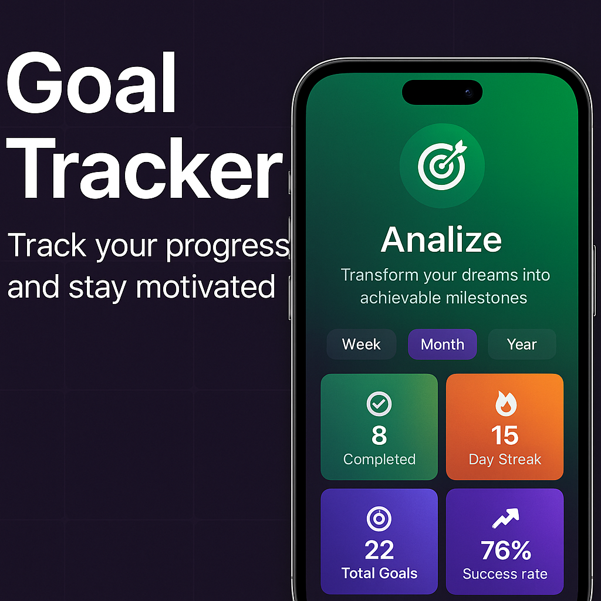

# 🎯 Goal Tracker App

A sleek and modern goal tracking mobile app to help users set, manage, and achieve personal goals — complete with streak tracking, progress visualization, and motivational insights.

---

## 🚀 Features

- ✅ Create and customize personal goals  
- 📊 Track progress with visual analytics  
- 🔥 Daily streak tracking to build consistency  
- 🧠 Motivational quotes and reward system  
- 🗂 Categories for goal types (Health, Learning, Career, etc.)  
- 💡 Insightful stats: Completion rate, streaks, daily average  
- 🌓 Dark mode friendly UI (NativeWind + Tailwind syntax)


---

## 🛠 Built With

- **React Native (Expo)**
- **Appwrite** – Authentication & database
- **NativeWind** – TailwindCSS for React Native
- **Lucide-react-native** – Icon set
- **Expo Router** – Navigation & routing

---

## ⚙️ Getting Started

```bash
git clone https://github.com/Marium-dotcom/Goal.git
cd Goal
yarn install or npm install
npx expo start
```

  > You dont need to add appwrites keys, I already added mine within the project.

---

## 📦 Folder Structure

```
├── app/                 # Screens & Routes (expo-router)
├── components/          # Reusable UI components
├── lib/                 # Appwrite services & auth context
├── assets/              # Icons & images
└── styles/              # Global Tailwind + fonts
```

---

## 🔒 Authentication

This app uses Appwrite's OAuth (Google) and Email/Password login.  
Custom fields like `firstName`, `lastName`, and profile picture are supported via user preferences.

---

## 📈 Analytics Screen

Includes:
- Weekly bar chart
- Category progress breakdown
- Key insights (streaks, success rate)
- Responsive design with gradient cards

---

## 💡 Future Ideas

- Community feed (like "For You" page) – *optional*
- Push notifications
- Gamification badges

---

## 🧠 Inspiration

Inspired by apps like **Duolingo** and **Habitica**, with a focus on clean UX and behavioral psychology.

---

## 🖼 GitHub Thumbnail

# Goal Tracker App 📱

<p align="center">
  
</p>

A goal-tracking mobile application built with React Native + Appwrite 💪

---

## 📬 Contact

Made with ❤️ by [Marium](https://github.com/Marium-dotcom)
